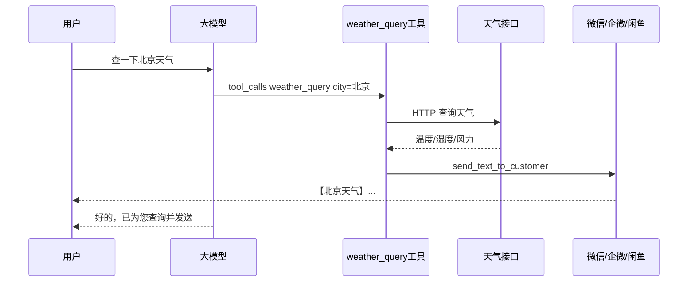

# 如何为冰石机器人扩展大模型工具：以天气查询为例

> 本文可直接发布到 CSDN。示例代码已收录在仓库 `backend/extensions/weather_query/`，完整 API 说明见 [自定义工具开发指南.md](自定义工具开发指南.md)。

**标签建议：** 智能客服、大模型、工具调用、Function Calling、Python、微信机器人

---

## 一、为什么要扩展工具？

冰石机器人（wxservice 智能客服系统）内置了发消息、查订单等通用工具，但每个行业的业务千差万别——查快递价、查库存、查天气、对接 ERP……不可能全部写进主程序。

系统的解法是：**在 `extensions/` 目录下开发自定义扩展**，注册成与大模型对接的 Tool。用户在微信 / 企业微信 / 闲鱼里说一句「查一下北京天气」，大模型识别意图后调用你的 `weather_query` 工具，工具查完天气再主动把结果发回当前会话。

整条链路如下：



本文用一个**完整的天气查询工具**走通全流程：写代码 → 配置提示词 → 后台启用 → 看效果。

---

## 二、扩展目录放哪里？

| 运行方式 | 扩展目录 |
|---------|---------|
| 源码开发 | `backend/extensions/weather_query/` |
| 打包 exe | `<exe 同目录>/extensions/weather_query/` |

每个扩展至少要有 `__init__.py` 和 `extension.py`（含 `register(ctx)` 入口）。推荐结构：

```
extensions/weather_query/
  __init__.py
  extension.py       # 注册入口
  tool.py            # 大模型看到的工具定义
  service.py         # 查天气业务逻辑
  city_codes.py      # 城市名 -> 城市编码
  message_sender.py  # 发消息到当前会话
```

---

## 三、天气接口选型（国内、免 API Key）

国内很多教程用过 `wthrcdn.etouch.cn`，但该接口近年稳定性较差。本文采用**双通道**策略：

| 优先级 | 接口 | 特点 |
|--------|------|------|
| 主通道 | `http://t.weather.itboy.net/api/weather/city/{citykey}` | 国内 CDN、**无需注册 Key**、返回中文 JSON |
| 备用 | `https://wttr.in/{城市}?format=j1&lang=zh` | 支持中文城市名，免 Key，主通道失败时使用 |

主通道需要城市编码（如北京 `101010100`），我们在 `city_codes.py` 维护常见城市映射；未收录的城市自动走 wttr.in。

**主通道返回示例（节选）：**

```json
{
  "status": 200,
  "cityInfo": { "city": "北京市", "citykey": "101010100" },
  "data": {
    "wendu": "26.5",
    "shidu": "28%",
    "quality": "优",
    "forecast": [
      { "type": "多云", "high": "高温 29℃", "low": "低温 20℃", "notice": "阴晴之间，谨防紫外线侵扰" }
    ]
  }
}
```

---

## 四、逐步实现

### 4.1 城市编码表 `city_codes.py`

```python
CITY_CODE_MAP = {
    "北京": "101010100",
    "上海": "101020100",
    "广州": "101280101",
    "深圳": "101280601",
    # ... 可按需继续添加
}

def normalize_city_name(name: str) -> str:
    s = (name or "").strip()
    for suffix in ("市", "省", "自治区"):
        if s.endswith(suffix):
            s = s[: -len(suffix)]
    return s.strip()

def resolve_city_code(city: str) -> str | None:
    key = normalize_city_name(city)
    return CITY_CODE_MAP.get(key)
```

用户说「北京市」「北京」都能正确匹配。

### 4.2 天气服务 `service.py`

核心逻辑：先 itboy，失败再 wttr.in，最后格式化成可读文本。

```python
import httpx

ITBOY_URL = "http://t.weather.itboy.net/api/weather/city/{citykey}"

class WeatherQueryService:
    async def query(self, city: str) -> dict:
        citykey = resolve_city_code(city)
        if citykey:
            try:
                async with httpx.AsyncClient(timeout=15) as client:
                    resp = await client.get(ITBOY_URL.format(citykey=citykey))
                    payload = resp.json()
                if payload.get("status") == 200:
                    return self._parse_itboy(payload, city)
            except Exception:
                pass  # 走备用通道
        return await self._query_wttr(city)

def format_weather_message(data: dict) -> str:
    return "\n".join([
        f"【{data['city']}天气】",
        f"天气：{data['weather_type']}",
        f"当前气温：{data['temperature']}℃",
        f"湿度：{data.get('humidity', '—')}",
        f"空气质量：{data.get('quality', '—')}",
    ])
```

格式化后的消息示例：

```
【北京市天气】
天气：多云
当前气温：26.5℃
湿度：28%
空气质量：优
风力：西南风 2级
提示：各类人群可自由活动
阴晴之间，谨防紫外线侵扰
```

### 4.3 发消息 `message_sender.py`

工具查完天气后要**发到当前会话**，不能让用户自己再去别处看 JSON。做法与官方扩展示例 `express_price_calc` 一致：

1. 用 `resolve_wechat_config(db, request)` 判断当前是个人微信、企微还是闲鱼；
2. 接收方默认取 `request.group_id` / `request.group_name`（即当前聊天）；
3. 分渠道调用底层发送 API。

**个人微信：**

```python
from core.wechat_manager import get_wechat_service
from schemas.wechat import MessageSend, MessageType

get_wechat_service().send_message(
    MessageSend(chat_id=recipient_id, content=text, message_type=MessageType.TEXT)
)
```

**企业微信：**

```python
wecom_service.send_text_message(
    guid=instance.guid,
    content=text,
    to_id=recipient_id,
    license_code=instance.license_code,
)
```

**闲鱼：** 从 `request.context.group_info` 取 `xianyu_chat_id`、`xianyu_to_id` 后调用 `session.send_message(...)`。

统一封装为：

```python
send_out = send_text_to_customer(db, request, recipient_id_override, message)
# 返回 {"ok": True/False, "channel": "...", "detail": "..."}
```

### 4.4 工具类 `tool.py` — 对接大模型

所有自定义工具必须继承 `BaseTool`，实现 5 个方法：

| 方法 | 作用 |
|------|------|
| `get_name()` | 工具唯一名：`weather_query` |
| `get_description()` | 给大模型看的说明，写清何时调用 |
| `get_tool_type()` | 类型，这里用 `DATA_QUERY` |
| `get_parameters()` | JSON Schema 参数定义 |
| `async execute(...)` | 执行：查天气 → 发消息 → 返回结果 |

`execute` 核心流程：

```python
async def execute(self, tool_call, request):
    city = tool_call.parameters.get("city")
    weather = await self._service.query(city)
    message = format_weather_message(weather)

    db = self._db_factory()
    try:
        send_out = send_text_to_customer(db, request, None, message)
    finally:
        db.close()

    return {
        "success": True,
        "city": city,
        "weather": weather,
        "message_sent": send_out.get("ok"),
        "formatted_message": message,
    }
```

**注意：** 工具已主动发消息，应在 `get_description` 里说明：提示词中宜设 `requires_tool_result: false`，避免大模型拿到结果后再发一遍重复内容。

### 4.5 注册入口 `extension.py`

```python
from .service import WeatherQueryService
from .tool import WeatherQueryTool

_service = WeatherQueryService()

def register(ctx):
    tool = WeatherQueryTool(_service, ctx.db_factory)
    try:
        ctx.tool_registry.register_tool(tool)
        ctx.logger.info("[weather_query] registered weather_query")
    except Exception as e:
        ctx.logger.warning(f"[weather_query] failed: {e}")

def unregister(ctx):
    ctx.logger.info("[weather_query] unregister called")
```

系统启动时 `ExtensionManager` 扫描 `extensions/` 下所有子目录，自动调用 `register(ctx)`，工具进入全局 `tool_registry`。

---

## 五、配置大模型提示词

工具代码写好只是第一步，还要让大模型**知道什么时候调用**。

在管理后台 → **聊天配置** → 编辑对应群组/私聊的 **大模型提示词**，增加类似说明：

```text
## 工具使用规则

当用户询问某地天气、气温、会不会下雨、穿衣建议等与天气相关的问题时：
1. 调用工具 weather_query，参数 city 填用户提到的城市名（如 北京、上海）。
2. 工具会自动查询天气并发送到当前会话，你只需简短确认即可，例如「好的，已为您查询并发送北京天气」。
3. 回复 JSON 时设置 requires_tool_result 为 false。

示例用户说法：
- 「查一下北京天气」
- 「上海今天热吗」
- 「深圳会不会下雨」
```

大模型输出格式（系统会自动解析）：

```json
{
  "reply_content": "好的，正在为您查询北京天气～",
  "reply_type": "text",
  "requires_tool_result": false,
  "tool_calls": [
    {
      "tool_name": "weather_query",
      "tool_type": "data_query",
      "parameters": { "city": "北京" },
      "description": "查询北京天气并发送给用户"
    }
  ],
  "confidence": 0.95
}
```

---

## 六、后台启用工具

1. 进入 **系统配置管理** → 对应账号（个人微信 / 企微 / 闲鱼）。
2. 打开 **启用工具调用功能**。
3. 点击 **选择工具**，勾选 `weather_query`（或留空表示启用全部工具）。
4. 保存配置。

**验证是否注册成功：**

```http
GET /api/tool-calling/tools/weather_query
```

应返回工具名、描述和 `city`、`send_to_customer` 等参数 schema。

**热重载扩展（开发阶段）：**

```http
POST /api/v1/extensions/reload
Content-Type: application/json

{"name": "weather_query"}
```

日志中出现 `[weather_query] registered weather_query` 即表示成功。

---

## 七、效果展示

### 7.1 个人微信私聊

```
┌──────────────────────────────────────┐
│  用户                          21:35 │
│  帮我查一下北京天气                    │
├──────────────────────────────────────┤
│  冰石机器人                    21:35 │
│  好的，已为您查询并发送北京天气～        │
├──────────────────────────────────────┤
│  冰石机器人                    21:35 │
│  【北京市天气】                        │
│  天气：多云                           │
│  当前气温：26.5℃                      │
│  今日：低温 20℃ ~ 高温 29℃            │
│  湿度：28%                            │
│  空气质量：优                          │
│  风力：西南风 2级                      │
│  提示：各类人群可自由活动               │
│  阴晴之间，谨防紫外线侵扰               │
└──────────────────────────────────────┘
```

第二条是工具 `send_text_to_customer` 发出；第一条是大模型的简短确认。

### 7.2 企业微信群聊

流程相同。工具通过 `resolve_wechat_config` 识别 `account_type=official`，走企微第三方 `send_text_message`，消息出现在当前群或私聊窗口。

### 7.3 工具返回 JSON（供排查）

若 `send_to_customer=false`（测试用），`execute` 返回：

```json
{
  "success": true,
  "city": "北京",
  "weather": {
    "city": "北京市",
    "source": "itboy",
    "temperature": "26.5",
    "weather_type": "多云",
    "quality": "优"
  },
  "formatted_message": "【北京市天气】\n天气：多云\n...",
  "message_sent": false,
  "send_status": "skipped"
}
```

---

## 八、本地快速测试

无需等用户发消息，可直接调测试接口：

```http
POST /api/tool-calling/test?tool_name=weather_query
Content-Type: application/json

{
  "city": "上海",
  "send_to_customer": false
}
```

或在 Python 中：

```python
import asyncio
from extensions.weather_query.service import WeatherQueryService, format_weather_message

async def main():
    svc = WeatherQueryService()
    data = await svc.query("杭州")
    print(format_weather_message(data))

asyncio.run(main())
```

---

## 九、常见问题

**Q：城市不在映射表里怎么办？**  
A：自动降级到 wttr.in，支持大多数中文城市名。可在 `city_codes.py` 继续补充编码。

**Q：工具注册了但大模型不调？**  
A：检查三点：① 后台是否勾选 `weather_query`；② 提示词是否写明调用条件；③ `enable_tools_calling` 是否开启。

**Q：消息没发出去？**  
A：看返回的 `send_status` 和 `send_error`。个人微信需客户端在线；企微需实例 `status=2`（已登录）；闲鱼需 `context.group_info` 含 `xianyu_chat_id`。

**Q：能否只返回 JSON 不让工具发消息？**  
A：可以，参数传 `"send_to_customer": false`，由大模型自己组织回复（需在提示词中说明）。

---

## 十、小结

扩展冰石机器人的大模型能力，本质上是四步：

1. **写扩展**：`extensions/<name>/` 下实现 `BaseTool` + `register(ctx)`  
2. **接业务**：HTTP 调第三方 API（本文：国内免 Key 天气接口）  
3. **发消息**：复用 `resolve_wechat_config` + 分渠道发送，把结果推回当前会话  
4. **配提示词 + 开工具**：让大模型知道何时 `tool_calls`，后台勾选启用  

天气查询只是入门示例。同一套模式可以扩展为：查物流、查库存、查课程表、算报价……业务逻辑换进 `service.py`，发消息逻辑复用 `message_sender.py`，就是属于你行业的专属大模型工具。

---

**相关文档**

- [自定义工具开发指南.md](自定义工具开发指南.md) — 完整 API 与 LLM 代码生成提示词  
- [机器人大模型与工具配置说明.md](机器人大模型与工具配置说明.md) — 后台配置截图说明  
- 示例源码：`backend/extensions/weather_query/`  
- 参考扩展：`backend/extensions/express_price_calc/`（带发消息的算价工具）

---

*如果本文对你有帮助，欢迎点赞收藏。有问题可在评论区留言交流。*
