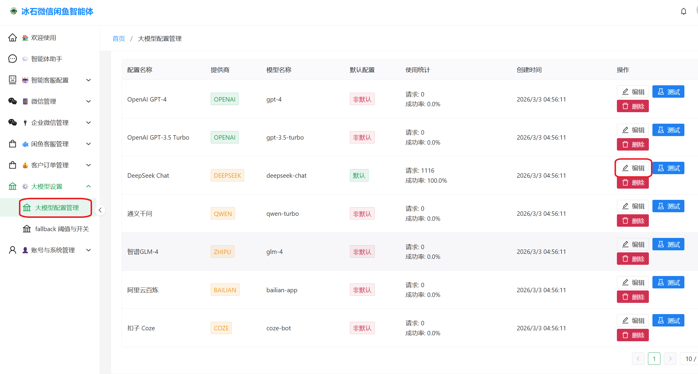
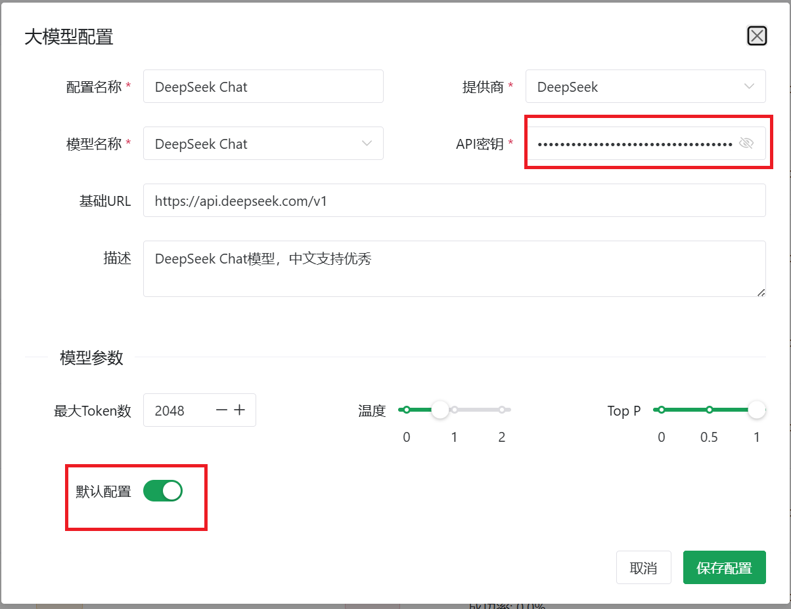
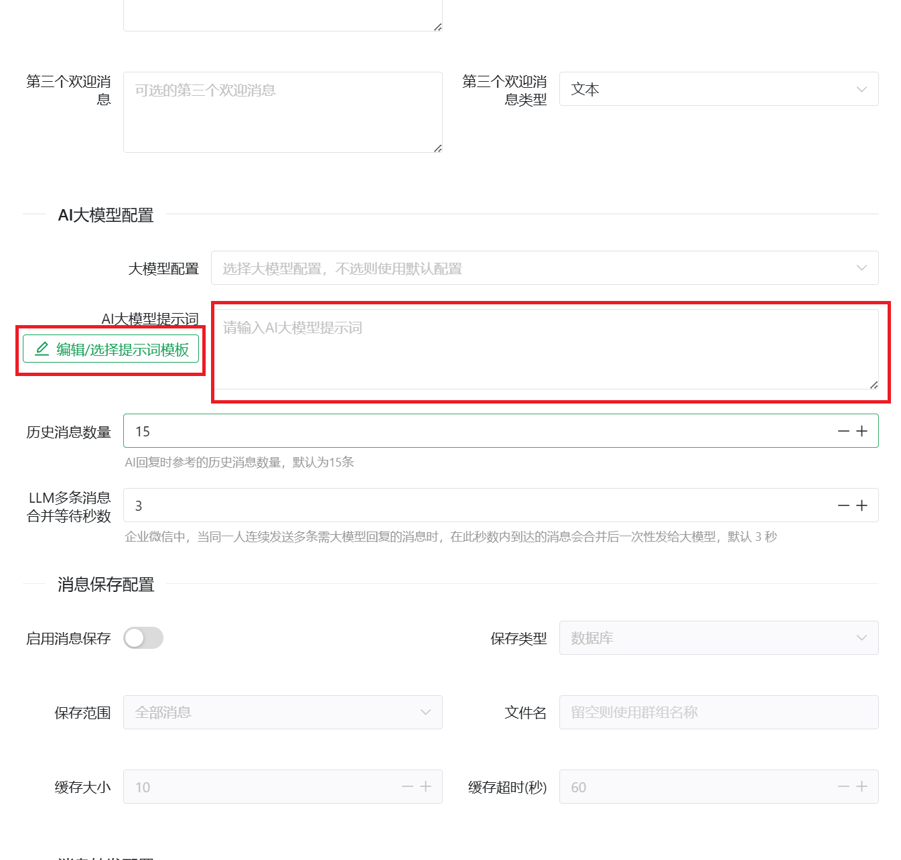
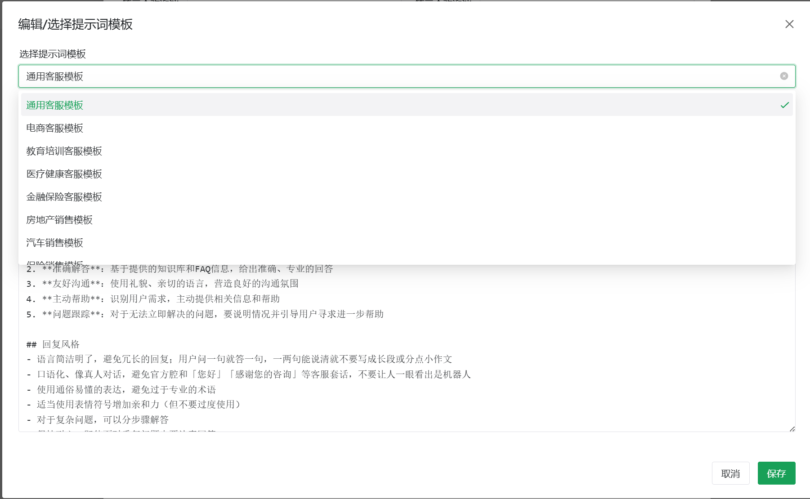
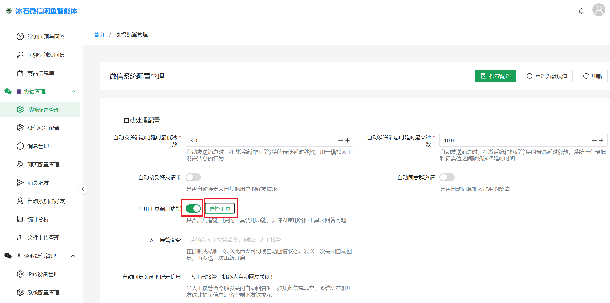
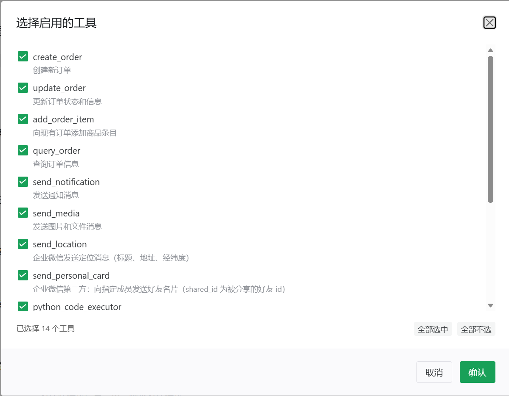

# 机器人大模型与工具配置说明

本文说明如何在管理后台为机器人配置大模型智能客服：包括接入第三方大模型的 API、为每个聊天场景编写提示词，以及按需启用内置工具。配图需与本文件位于同一目录 `docs/` 下，文件名为下文所列的 PNG 名称；若仓库中尚未包含这些截图，请将对应界面截图保存为同名文件后再查看文档中的插图。

---

## 概述

智能客服正常运行通常需要三块配置：

1. **大模型连接信息**：在「大模型配置管理」中为所选提供商填写 API 密钥、基础 URL 等，并可指定默认使用的模型配置。
2. **会话级行为**：在「微信/企业微信聊天配置」的编辑页中，选择大模型配置并编写 **AI 大模型提示词**（也可使用提示词模板）。
3. **工具能力**：在「系统配置管理」中开启 **启用工具调用功能**，并在 **选择工具** 中勾选允许大模型调用的工具；未启用或未勾选的工具不会对智能回复生效。

以下分步说明操作路径与注意事项。

---

## 步骤一：大模型配置（API 密钥等）

1. 在管理后台左侧菜单进入 **「大模型设置」→「大模型配置管理」**（对应前端路由 `llm-config`）。
2. 在配置列表中找到要使用的提供商/模型（例如 DeepSeek、OpenAI 等），点击 **「编辑」**。
3. 在弹出的对话框中填写 **API 密钥**、**基础 URL**（若使用官方默认可保持预设），按需调整 **模型参数**（如最大 Token、温度等）。
4. 若希望该配置作为系统默认大模型，打开 **「默认配置」** 开关，然后点击 **「保存配置」**。





---

## 步骤二：聊天配置（大模型提示词）

需要为 **每个微信群/私聊（聊天配置）** 指定是否使用该大模型以及如何回复：

### 个人微信

1. 进入 **「微信管理」→「微信聊天配置管理」**。
2. 打开对应聊天或群组的 **编辑** 页面。
3. 在 **「AI 大模型配置」** 区域：
   - **大模型配置**：下拉选择步骤一中已保存的配置（不选则可能使用系统默认配置，具体以后台逻辑为准）。
   - **AI 大模型提示词**：填写该场景下的系统指令、业务规则等；可点击 **「编辑/选择提示词模板」** 从数据库中的行业预设模板起步再修改；在对话框内还可将当前内容 **另存为新模板** 或 **覆盖更新已有模板**（含预设与自定义），供团队复用（需已执行系统种子数据初始化）。





### 企业微信（第三方接入）

1. 进入 **「企业微信第三方」→「企业微信聊天配置管理」**（与个人微信类似，为对应账号下的聊天配置编辑页）。
2. 同样设置 **大模型配置** 与 **AI 大模型提示词**，并可使用提示词模板。

企业微信场景下还可关注 **历史消息数量**、**多条消息合并等待秒数** 等与上下文相关的参数，按业务需要调整。

---

## 步骤三：系统配置（启用工具与选择工具）

大模型 **调用内置工具**（发通知、发图片、建群发任务等）前，必须在对应账号的 **系统配置** 中显式打开开关并勾选工具。

### 个人微信

1. 进入 **「微信管理」→「系统配置管理」**。
2. 找到 **「自动处理配置」** 中的 **「启用工具调用功能」**，将开关置于开启状态。
3. 点击 **「选择工具」**，在对话框中勾选需要启用的工具（可使用「全部选中」等快捷操作）。
4. 确认后返回页面，点击 **「保存配置」** 使设置生效。





### 企业微信第三方

1. 进入 **「企业微信第三方」** 下对应的 **「系统配置管理」**（路由与微信侧独立，请以侧栏为准）。
2. 同样开启 **「启用工具调用功能」**，通过 **「选择工具」** 勾选工具并 **保存配置**。

> **说明**：管理界面中显示的工具数量可能与下文「内置工具列表」的 17 项不完全一致。若部署了扩展插件，扩展可向系统注册额外工具，列表会变长。请以当前界面或接口为准（见下文「与部署环境核对工具清单」）。

---

## 内置工具列表

以下为后端启动时默认注册的 **20 个** 内置工具（见 `backend/core/tool_execution_manager.py` 与 `backend/tools/__init__.py`）。**工具类型** 对应枚举 `ToolType`（定义见 `backend/schemas/tool_calling.py`）。

| 工具名称 | 工具类型 | 说明 |
|----------|----------|------|
| `create_order` | `order` | 创建新订单 |
| `update_order` | `order` | 更新订单状态和信息 |
| `add_order_item` | `order` | 向现有订单添加商品条目 |
| `query_order` | `data_query` | 查询订单信息 |
| `send_notification` | `notification` | 发送通知消息 |
| `send_media` | `file_operation` | 发送图片、视频和文件消息 |
| `send_voice` | `file_operation` | 企业微信第三方：发送语音消息（WAV / SILK；WAV 自动转为 SILK 后发送） |
| `send_favorite` | `notification` | 个人微信：从微信收藏发送指定条目到联系人或当前会话（不支持企业微信/闲鱼） |
| `send_location` | `notification` | 企业微信发送定位消息（标题、地址、经纬度） |
| `send_link` | `notification` | 企业微信第三方：发送链接消息（富文本卡片，含标题、图标、链接与描述） |
| `send_at_notification` | `notification` | 企业微信第三方：发送 @ 指定成员或 @ 所有人的消息，可附带文本内容 |
| `send_personal_card` | `notification` | 企业微信第三方：向指定成员发送好友名片（`shared_id` 为被分享的好友 id） |
| `switch_session_mode` | `system_action` | 切换当前会话为人工接管或机器人回复，支持个人微信/企业微信/闲鱼 |
| `python_code_executor` | `system_action` | 执行 Python 代码 |
| `create_broadcast_config` | `system_action` | 创建消息群发配置，支持定时发送（每天/每周/每月/指定日期）、发送时间、目标群组、消息类型与内容、配置名称 |
| `update_customer_note` | `system_action` | 根据用户信息（用户名或客户 ID）更新客户备注；不传用户信息时使用当前发送人 |
| `set_friend_remark_tag` | `system_action` | 为好友设置备注和/或单个标签；个人微信通过客户端 UI（`remove_tags` 仅个人微信）；企业微信第三方通过 API 更新当前会话外部联系人备注并追加标签 |
| `wecom_contact_personal_label` | `system_action` | 企业微信第三方：为当前聊天的客户按名称添加或删除个人标签（无同名标签时添加会自动创建） |
| `clear_session_chat_history` | `system_action` | 删除当前会话在系统中已保存的聊天消息记录；仅在用户明确要求清空/重置上下文时使用 |
| `cancel_no_reply_followup_wait` | `system_action` | 中止当前会话的无回复续聊等待，取消已启动的跟进计时并重置计数 |

类型含义简要对应：**order** 订单相关；**notification** 通知与消息类能力；**data_query** 数据查询；**file_operation** 文件/媒体操作；**system_action** 系统级操作。

> **说明**：**滴灌群发** 为管理后台独立功能（路由 `drip-broadcast`），**不是** 大模型内置工具，无法通过工具调用创建滴灌任务。

### 与部署环境核对工具清单

若需确认当前运行实例上 **实际可用** 的工具（含扩展注册的额外工具）及每个工具的参数结构，可调用后端 HTTP 接口：

- **列出全部已注册工具**：`GET /api/tool-calling/tools`  
  返回每个工具的描述、类型、参数模式等信息，便于与界面勾选列表或外部平台（扣子、阿里云百炼等）配置对照。

- **查询单个工具**：`GET /api/tool-calling/tools/{tool_name}`  
  用于核对某一工具的参数是否与文档或附录一致。

参数细节以接口返回或各 `backend/tools/*_tool.py` 中 `get_parameters()` 为准；升级版本后若行为有变化，请优先以接口与源码为准。

---

## 工具使用示例

以下示例用于写在 **提示词** 或 **用户可见的说明** 中，指导模型在合适场景下发起工具调用（实际 JSON 格式见附录）。

### 发送通知（`send_notification`）

可用于让工具发送微信或企业微信消息。

- **个人微信**：`recipient_id` 请使用接收者的 **微信显示名/会话标识**（与后台可识别的昵称或聊天名一致），按实际环境填写。
- **企业微信**：通常需要使用 **企业微信侧联系人标识**（如成员 userId 等，与接口约定一致）；请以当前接入方式与后台配置为准。
- 若未指定接收人，消息一般会发往 **当前需要自动回复的会话对象**（当前上下文中的用户或群）。

示例话术：

```text
请调用发送通知的工具给{某某人}发送微信消息
```

将 `{某某人}` 替换为实际接收者标识。

### 切换会话模式（`switch_session_mode`）

用于在当前会话切换 **人工接管** 与 **机器人回复**：

- 切换为人工接管：`mode=human`
- 恢复机器人回复：`mode=bot`

示例话术（人工接管）：

```text
请调用切换当前会话模式工具，把当前会话切换为人工接管
```

示例话术（恢复机器人）：

```text
请调用切换当前会话模式工具，把当前会话切换为机器人回复
```

### 发送图片 / 视频 / 文件（`send_media`）

- 需要先把文件放到机器人可访问的位置：
  - 使用管理后台 **「文件上传管理」** 上传到机器人；或
  - 将文件复制到 **机器人程序所在目录下的 `uploads` 目录**（注意：是 `uploads` 根目录，不是 `uploads\images` 子目录，除非你的路径约定如此）。
- `file_path` 参数：相对路径一般 **相对于 `uploads` 目录**，也支持绝对路径（与 `send_media` 工具参数说明一致）。

示例：

```text
请调用发送图片的工具，发送下面的图片：需要发送的图片名称.jpg
```

### 企业微信：发送语音（`send_voice`）

- **仅企业微信（official）** 可用。
- 支持 **WAV** 与 **SILK**（`.silk` / `.slk`）格式；WAV 会在发送前自动转为企微兼容 SILK（依赖 `pilk`）。
- 文件需放在 **`uploads` 目录**（或通过管理后台上传），`file_path` 相对路径基于 `uploads`，也支持绝对路径。
- `voice_time`（秒）可选；未提供时从语音文件自动解析时长。
- 未指定 `recipient_id` 时，默认发往 **当前会话**（企微优先 `group_id`，其次 `group_name`）。

示例（WAV，自动解析时长）：

```text
请调用发送语音的工具，发送语音文件：welcome.wav
```

```json
{
  "file_path": "welcome.wav"
}
```

示例（SILK，指定时长）：

```json
{
  "file_path": "notice.silk",
  "voice_time": 5,
  "recipient_id": "10791136095291"
}
```

### 创建消息群发配置（`create_broadcast_config`）

用于配置 **定时群发**（如每天固定时间、指定群组、文本/图片等）。

示例：

```text
请调用创建消息群发配置工具，在设定的时间发送消息
```

具体定时规则、群组名称、消息类型等通过工具参数传入（见附录中的参数说明）。

### 企业微信：发送定位（`send_location`）

需提供 `title`、`address` 以及经纬度 `latitude`、`longitude`。

示例：

```text
请调用发送定位的工具发送下面的定位：
```

```json
{
  "title": "南岸区茶园(重庆第二师范学院)",
  "address": "重庆市南岸区",
  "latitude": 29.510868,
  "longitude": 106.656882
}
```

### 企业微信：发送链接（`send_link`）

- **仅企业微信（official）** 可用。
- 需提供 `title`（标题）、`icon_url`（图标 URL）、`link_url`（跳转链接）、`desc`（描述）。
- 未指定 `recipient_id` 时，默认发往 **当前会话**（`group_id` / `group_name`）。

示例：

```text
请调用发送链接的工具，发送下面的链接卡片：
```

```json
{
  "title": "产品详情",
  "icon_url": "https://wework.qpic.cn/wwp**3az/59411_H0x4p2RNQHmdDjh_1709274772/0",
  "link_url": "https://www.example.com/product/123",
  "desc": "点击查看完整产品介绍"
}
```

### 企业微信：发送 @ 消息（`send_at_notification`）

- **仅企业微信（official）** 可用。
- `at_all=true` 时 @ 所有人；否则通过 `at_user_ids` 指定要 @ 的成员 userId（可传数组或逗号分隔字符串）。
- `message` 为附带文本，可省略（仅 @ 不附带文字也支持）。
- 未指定 `recipient_id` 时，默认发往 **当前会话**（`group_id` / `group_name`）。

示例（@ 指定成员）：

```text
请调用发送 @ 消息工具，在群里 @ 成员 7881301987664，并附带文本：请尽快处理
```

```json
{
  "at_user_ids": ["7881301987664"],
  "message": "请尽快处理",
  "recipient_id": "10791136095291"
}
```

示例（@ 所有人）：

```text
请调用发送 @ 消息工具，在当前群 @ 所有人，并通知：会议 10 分钟后开始
```

```json
{
  "at_all": true,
  "message": "会议 10 分钟后开始"
}
```

### 企业微信：发送个人名片（`send_personal_card`）

`shared_id` 为被分享联系人在企业微信中的 id。

示例：

```text
请调用发送名片的工具，发送这个企业微信id的名片：123456789
```

### 个人微信：发送收藏内容（`send_favorite`）

- **仅个人微信** 可用；企业微信、闲鱼暂不支持。
- `item_name` 为收藏条目名称，用于在收藏页搜索过滤。
- 未指定 `recipient` 时，默认发送到 **当前会话**。

示例：

```text
请调用发送收藏工具，发送收藏里名为「产品介绍PPT」的内容
```

### 设置好友备注与标签（`set_friend_remark_tag`）

- **个人微信**：通过客户端 UI 设置；`remark`、`tags`、`remove_tags` 至少填一项；`remove_tags` 为要删除的标签列表（仅个人微信支持，会先删后加）；未传 `recipient` 时从当前会话解析好友昵称。
- **企业微信第三方**：通过 API 更新当前会话外部联系人的备注，并追加个人标签（保留已有标签）；不支持 `remove_tags`；需会话上下文含客户 userId。

示例（个人微信）：

```text
请调用设置好友备注和标签工具，给当前好友设置备注「VIP客户」，并打上标签「高意向」
```

示例（企业微信）：

```text
请调用设置好友备注和标签工具，将当前客户的备注更新为「已预约到店」
```

### 企业微信：客户个人标签（`wecom_contact_personal_label`）

- **仅企业微信（official）** 可用；`action` 为 `add`（添加）或 `remove`（删除）。
- 无同名个人标签时，`add` 会自动创建该标签后再打上。

示例：

```text
请调用企业微信个人标签工具，为当前客户添加标签「已成交」
```

```text
请调用企业微信个人标签工具，从当前客户移除标签「待跟进」
```

### 清空会话聊天记录（`clear_session_chat_history`）

删除当前会话在系统中 **已落库** 的消息（含系统消息），后续大模型回复将不再引用此前对话。

- **仅在用户明确要求** 清空聊天记录、忘记历史或重置上下文时使用，勿主动调用。
- 无工具参数，依赖当前会话的 `config_id` 与 `group_id` / `group_name`。

示例：

```text
用户要求忘记之前的对话时，请调用清空会话聊天记录工具
```

### 取消无回复续聊等待（`cancel_no_reply_followup_wait`）

中止当前会话已启动的「客户未回复则自动跟进」计时，并重置本条跟进链路的计数。

- 适用于已明确结束本轮跟进、不希望再自动发续聊话术的场合；勿在无用户诉求时滥用。
- 无工具参数。

示例：

```text
客户已回复并结束本轮跟进，请调用取消无回复续聊等待工具
```

---

## 多句拆成多条消息

若希望机器人 **不要把一整段话打在一条消息里**，而是拆成多条短消息发送，可在提示词中约定行数，并要求在必要时 **调用发送消息类工具**（如 `send_notification`，需已在系统配置中启用）分多次发送。

示例提示词：

```text
回复客户的内容不超过3行，每次一行，必要时调用发送消息的工具来把回复的内容分成多条消息发送。
```

请确保已启用 **工具调用**，并勾选 **`send_notification`**（或你实际用来发文本消息的工具）。

---

## 附录：外部平台可粘贴的完整工具提示词

若在其他平台（如扣子、阿里云百炼等）配置「工具 + 提示词」，可将下面整段作为系统提示词的一部分；其中 **「可用工具」** 的详细定义需与各工具在当前后端的参数保持一致。以下为便于离线使用的完整模板；**维护时** 请用 `GET /api/tool-calling/tools` 或 `GET /api/tool-calling/tools/{tool_name}` 核对参数是否与运行环境一致。

````text
你是一个智能AI助手，可以调用各种工具来帮助用户。

## 可用工具

### 向现有订单添加商品条目
- 工具名称: add_order_item
- 工具类型: ToolType.ORDER
- 参数: {
  "order_id": {
    "type": "string",
    "required": true,
    "description": "订单ID或订单号"
  },
  "order_item": {
    "type": "object",
    "required": true,
    "description": "订单条目信息",
    "properties": {
      "product_id": {
        "type": "string",
        "required": false,
        "description": "产品ID"
      },
      "product_name": {
        "type": "string",
        "required": true,
        "description": "产品名称"
      },
      "product_sku": {
        "type": "string",
        "required": false,
        "description": "产品SKU"
      },
      "quantity": {
        "type": "integer",
        "required": true,
        "description": "数量"
      },
      "unit_price": {
        "type": "number",
        "required": true,
        "description": "单价"
      },
      "specifications": {
        "type": "object",
        "required": false,
        "description": "产品规格"
      },
      "material": {
        "type": "string",
        "required": false,
        "description": "材质"
      },
      "color": {
        "type": "string",
        "required": false,
        "description": "颜色"
      },
      "size": {
        "type": "string",
        "required": false,
        "description": "尺寸"
      },
      "notes": {
        "type": "string",
        "required": false,
        "description": "条目备注"
      }
    }
  }
}


### 创建消息群发配置，支持定时发送（每天/每周/每月/指定日期）、发送时间、目标群组、消息类型与内容、配置名称
- 工具名称: create_broadcast_config
- 工具类型: ToolType.SYSTEM_ACTION
- 参数: {
  "name": {
    "type": "string",
    "required": true,
    "description": "配置名称"
  },
  "schedule_type": {
    "type": "string",
    "required": true,
    "description": "定时类型: daily(每天), weekly(每周), monthly(每月), once(指定日期)"
  },
  "schedule_time": {
    "type": "string",
    "required": true,
    "description": "点模式 HH:mm（如 09:00）；时段内重复为 开始|结束|间隔秒，如 09:00|18:00|1800（每30分钟）"
  },
  "group_names": {
    "type": "array",
    "required": true,
    "description": "目标群组/私聊名称列表"
  },
  "message_type": {
    "type": "string",
    "required": true,
    "description": "消息类型: text, image, file, video"
  },
  "message_content": {
    "type": "string",
    "required": true,
    "description": "消息内容"
  },
  "config_id": {
    "type": "integer",
    "required": false,
    "description": "微信配置ID，个人微信通常不传；不传则从当前会话的群组/配置解析"
  },
  "weekdays": {
    "type": "array",
    "required": false,
    "description": "每周发送的星期 [0-6]，0=周一；schedule_type 为 weekly 时必填，如 [1,3,5]"
  },
  "month_days": {
    "type": "array",
    "required": false,
    "description": "每月发送的日期 [1-31]；schedule_type 为 monthly 时必填，如 [1,15]"
  },
  "start_date": {
    "type": "string",
    "required": false,
    "description": "指定日期，格式 YYYY-MM-DD；schedule_type 为 once 时必填"
  },
  "description": {
    "type": "string",
    "required": false,
    "description": "配置描述"
  },
  "end_date": {
    "type": "string",
    "required": false,
    "description": "结束日期，格式 YYYY-MM-DD"
  },
  "status": {
    "type": "string",
    "required": false,
    "description": "状态: active, inactive, paused，默认 active"
  },
  "enabled": {
    "type": "boolean",
    "required": false,
    "description": "是否启用，默认 true"
  },
  "retry_count": {
    "type": "integer",
    "required": false,
    "description": "重试次数，默认 3"
  },
  "retry_interval": {
    "type": "integer",
    "required": false,
    "description": "重试间隔(秒)，默认 300"
  },
  "priority": {
    "type": "integer",
    "required": false,
    "description": "优先级，数字越小越高，默认 0"
  }
}


### 创建新订单
- 工具名称: create_order
- 工具类型: ToolType.ORDER
- 参数: {
  "customer_info": {
    "type": "object",
    "required": true,
    "description": "客户信息",
    "properties": {
      "name": {
        "type": "string",
        "required": true,
        "description": "客户姓名"
      },
      "phone": {
        "type": "string",
        "required": true,
        "description": "手机号码"
      },
      "email": {
        "type": "string",
        "required": false,
        "description": "邮箱地址"
      },
      "company": {
        "type": "string",
        "required": false,
        "description": "公司名称"
      },
      "address": {
        "type": "string",
        "required": false,
        "description": "详细地址"
      },
      "city": {
        "type": "string",
        "required": false,
        "description": "城市"
      },
      "province": {
        "type": "string",
        "required": false,
        "description": "省份"
      },
      "wechat_id": {
        "type": "string",
        "required": false,
        "description": "微信号"
      }
    }
  },
  "order_items": {
    "type": "array",
    "required": true,
    "description": "订单商品条目列表",
    "items": {
      "type": "object",
      "properties": {
        "product_id": {
          "type": "string",
          "required": false,
          "description": "产品ID"
        },
        "product_name": {
          "type": "string",
          "required": true,
          "description": "产品名称"
        },
        "product_sku": {
          "type": "string",
          "required": false,
          "description": "产品SKU"
        },
        "quantity": {
          "type": "integer",
          "required": true,
          "description": "数量"
        },
        "unit_price": {
          "type": "number",
          "required": true,
          "description": "单价"
        },
        "specifications": {
          "type": "object",
          "required": false,
          "description": "产品规格"
        },
        "material": {
          "type": "string",
          "required": false,
          "description": "材质"
        },
        "color": {
          "type": "string",
          "required": false,
          "description": "颜色"
        },
        "size": {
          "type": "string",
          "required": false,
          "description": "尺寸"
        },
        "notes": {
          "type": "string",
          "required": false,
          "description": "条目备注"
        }
      }
    }
  },
  "shipping_info": {
    "type": "object",
    "required": false,
    "description": "收货信息",
    "properties": {
      "shipping_name": {
        "type": "string",
        "required": false,
        "description": "收货人姓名"
      },
      "shipping_phone": {
        "type": "string",
        "required": false,
        "description": "收货人电话"
      },
      "shipping_address": {
        "type": "string",
        "required": false,
        "description": "收货地址"
      },
      "shipping_city": {
        "type": "string",
        "required": false,
        "description": "收货城市"
      },
      "shipping_province": {
        "type": "string",
        "required": false,
        "description": "收货省份"
      },
      "shipping_postal_code": {
        "type": "string",
        "required": false,
        "description": "收货邮编"
      }
    }
  },
  "order_info": {
    "type": "object",
    "required": false,
    "description": "订单其他信息",
    "properties": {
      "payment_method": {
        "type": "string",
        "required": false,
        "description": "支付方式"
      },
      "shipping_cost": {
        "type": "number",
        "required": false,
        "description": "运费"
      },
      "tax_amount": {
        "type": "number",
        "required": false,
        "description": "税费"
      },
      "discount_amount": {
        "type": "number",
        "required": false,
        "description": "折扣金额"
      },
      "notes": {
        "type": "string",
        "required": false,
        "description": "订单备注"
      },
      "priority": {
        "type": "integer",
        "required": false,
        "description": "优先级"
      },
      "expected_delivery_date": {
        "type": "string",
        "required": false,
        "description": "预计送达日期"
      }
    }
  }
}


### 执行Python代码
- 工具名称: python_code_executor
- 工具类型: ToolType.SYSTEM_ACTION
- 参数: {
  "type": "object",
  "properties": {
    "code": {
      "type": "string",
      "description": "要执行的Python代码"
    },
    "context": {
      "type": "object",
      "description": "消息上下文信息",
      "properties": {
        "user_id": {
          "type": "string",
          "description": "用户ID"
        },
        "group_id": {
          "type": "string",
          "description": "聊天配置ID"
        },
        "group_name": {
          "type": "string",
          "description": "群组/私聊名称"
        },
        "message_content": {
          "type": "string",
          "description": "消息内容"
        },
        "keyword": {
          "type": "string",
          "description": "匹配的关键词"
        },
        "message_timestamp": {
          "type": "string",
          "description": "消息时间戳"
        },
        "message_type": {
          "type": "string",
          "description": "消息类型"
        },
        "sender_id": {
          "type": "string",
          "description": "发送者ID"
        },
        "sender_name": {
          "type": "string",
          "description": "发送者名称"
        },
        "chat_type": {
          "type": "string",
          "description": "聊天类型"
        },
        "direction": {
          "type": "string",
          "description": "消息方向"
        }
      }
    }
  },
  "required": [
    "code"
  ]
}


### 查询订单信息
- 工具名称: query_order
- 工具类型: ToolType.DATA_QUERY
- 参数: {
  "order_id": {
    "type": "string",
    "required": false,
    "description": "订单ID或订单号"
  },
  "customer_phone": {
    "type": "string",
    "required": false,
    "description": "客户手机号"
  },
  "customer_name": {
    "type": "string",
    "required": false,
    "description": "客户姓名"
  },
  "status": {
    "type": "string",
    "required": false,
    "description": "订单状态"
  },
  "start_date": {
    "type": "string",
    "required": false,
    "description": "开始日期"
  },
  "end_date": {
    "type": "string",
    "required": false,
    "description": "结束日期"
  },
  "limit": {
    "type": "integer",
    "required": false,
    "description": "返回数量限制"
  }
}


### 企业微信发送定位消息（标题、地址、经纬度）
- 工具名称: send_location
- 工具类型: ToolType.NOTIFICATION
- 参数: {
  "title": {
    "type": "string",
    "required": true,
    "description": "位置标题"
  },
  "address": {
    "type": "string",
    "required": true,
    "description": "地址描述"
  },
  "latitude": {
    "type": "number",
    "required": true,
    "description": "纬度"
  },
  "longitude": {
    "type": "number",
    "required": true,
    "description": "经度"
  },
  "recipient_id": {
    "type": "string",
    "required": false,
    "description": "接收者 id 或群 id；不提供则使用当前会话的 group_id / group_name"
  }
}


### 企业微信第三方：发送链接消息（富文本卡片，含标题、图标、链接与描述）
- 工具名称: send_link
- 工具类型: ToolType.NOTIFICATION
- 参数: {
  "title": {
    "type": "string",
    "required": true,
    "description": "链接卡片标题"
  },
  "icon_url": {
    "type": "string",
    "required": true,
    "description": "链接卡片图标 URL"
  },
  "link_url": {
    "type": "string",
    "required": true,
    "description": "跳转链接 URL"
  },
  "desc": {
    "type": "string",
    "required": true,
    "description": "链接卡片描述"
  },
  "recipient_id": {
    "type": "string",
    "required": false,
    "description": "接收者 id 或群 id；不提供则使用当前会话的 group_id / group_name"
  }
}


### 企业微信第三方：发送 @ 指定成员或 @ 所有人的消息，可附带文本内容
- 工具名称: send_at_notification
- 工具类型: ToolType.NOTIFICATION
- 参数: {
  "message": {
    "type": "string",
    "required": false,
    "description": "附带的文本内容"
  },
  "at_user_ids": {
    "type": "array",
    "required": false,
    "description": "要 @ 的成员 userId 列表；at_all 为 true 时可省略"
  },
  "at_all": {
    "type": "boolean",
    "required": false,
    "description": "为 true 时 @ 所有人"
  },
  "recipient_id": {
    "type": "string",
    "required": false,
    "description": "接收消息的会话/群 id；不提供则使用当前会话的 group_id / group_name"
  }
}


### 发送图片、视频和文件消息
- 工具名称: send_media
- 工具类型: ToolType.FILE_OPERATION
- 参数: {
  "media_type": {
    "type": "string",
    "required": true,
    "description": "媒体类型: image(图片)、video(视频) 或 file(文件)"
  },
  "file_path": {
    "type": "string",
    "required": true,
    "description": "文件路径，相对路径基于 uploads 目录，也支持绝对路径"
  },
  "recipient_id": {
    "type": "string",
    "required": false,
    "description": "接收者id或者聊天配置ID，如果不提供则默认发送到当前群组"
  }
}


### 企业微信第三方：发送语音消息（WAV / SILK，WAV 自动转为 SILK）
- 工具名称: send_voice
- 工具类型: ToolType.FILE_OPERATION
- 参数: {
  "file_path": {
    "type": "string",
    "required": true,
    "description": "WAV 或 SILK 语音文件路径，相对路径基于 uploads 目录，也支持绝对路径"
  },
  "voice_time": {
    "type": "integer",
    "required": false,
    "description": "语音时长（秒）；未提供时自动从语音文件解析"
  },
  "recipient_id": {
    "type": "string",
    "required": false,
    "description": "接收者 id 或群 id；不提供则使用当前会话的 group_id / group_name"
  }
}


### 发送通知消息
- 工具名称: send_notification
- 工具类型: ToolType.NOTIFICATION
- 参数: {
  "message": {
    "type": "string",
    "required": true,
    "description": "通知内容"
  },
  "recipient_type": {
    "type": "string",
    "required": true,
    "description": "接收者类型:wechat,email"
  },
  "recipient_id": {
    "type": "string",
    "required": false,
    "description": "接收者昵称或者群组/私聊名称"
  }
}


### 企业微信第三方：向指定成员发送好友名片（shared_id 为被分享的好友 id）
- 工具名称: send_personal_card
- 工具类型: ToolType.NOTIFICATION
- 参数: {
  "shared_id": {
    "type": "string",
    "required": true,
    "description": "要分享的好友 id（企业微信 userId）"
  },
  "recipient_id": {
    "type": "string",
    "required": false,
    "description": "接收消息的成员 id（企业微信 userId）；不提供则使用当前会话的 group_id，其次 user_id"
  }
}


### 根据用户信息（用户名或客户ID）更新客户备注；不传用户信息时使用当前发送人。传入新备注内容即可。
- 工具名称: update_customer_note
- 工具类型: ToolType.SYSTEM_ACTION
- 参数: {
  "user_info": {
    "type": "string",
    "required": false,
    "description": "客户用户名或客户ID，不传则使用当前发送人"
  },
  "note": {
    "type": "string",
    "required": true,
    "description": "新的备注内容"
  }
}


### 更新订单状态和信息
- 工具名称: update_order
- 工具类型: ToolType.ORDER
- 参数: {
  "order_id": {
    "type": "string",
    "required": true,
    "description": "订单ID或订单号"
  },
  "status": {
    "type": "string",
    "required": false,
    "description": "订单状态"
  },
  "payment_status": {
    "type": "string",
    "required": false,
    "description": "支付状态"
  },
  "payment_method": {
    "type": "string",
    "required": false,
    "description": "支付方式"
  },
  "shipping_info": {
    "type": "object",
    "required": false,
    "description": "收货信息更新"
  },
  "notes": {
    "type": "string",
    "required": false,
    "description": "订单备注"
  },
  "internal_notes": {
    "type": "string",
    "required": false,
    "description": "内部备注"
  },
  "tags": {
    "type": "array",
    "required": false,
    "description": "订单标签"
  }
}

### 切换当前会话模式：mode=human(人工接管) 或 mode=bot(机器人回复)
- 工具名称: switch_session_mode
- 工具类型: ToolType.SYSTEM_ACTION
- 说明: 支持个人微信、企业微信、闲鱼。默认对当前会话生效；
- 参数: {
  "mode": {
    "type": "string",
    "required": true,
    "description": "会话模式：human(人工接管) 或 bot(机器人回复)"
  }
}


### 从微信收藏发送指定条目到联系人或当前会话
- 工具名称: send_favorite
- 工具类型: ToolType.NOTIFICATION
- 说明: 仅个人微信可用；不支持企业微信、闲鱼
- 参数: {
  "item_name": {
    "type": "string",
    "required": true,
    "description": "收藏条目名称，用于在收藏页搜索过滤"
  },
  "recipient": {
    "type": "string",
    "required": false,
    "description": "接收人昵称或群名；不提供则发送到当前会话"
  }
}


### 为好友设置备注和/或单个标签；个人微信可先删除指定标签再添加新标签
- 工具名称: set_friend_remark_tag
- 工具类型: ToolType.SYSTEM_ACTION
- 说明: 个人微信通过客户端 UI 设置；remove_tags 仅个人微信支持。企业微信第三方通过 API 更新当前会话外部联系人备注，tags 为追加个人标签；需会话上下文含客户 userId
- 参数: {
  "remark": {
    "type": "string",
    "required": false,
    "description": "好友备注"
  },
  "tags": {
    "type": "string",
    "required": false,
    "description": "单个好友标签"
  },
  "remove_tags": {
    "type": "array",
    "items": {"type": "string"},
    "required": false,
    "description": "要删除的好友标签列表；仅个人微信支持，会先删除再添加 tags"
  },
  "recipient": {
    "type": "string",
    "required": false,
    "description": "好友昵称；个人微信不提供则从当前会话解析；企业微信仅作日志"
  }
}


### 企业微信第三方：为当前聊天的客户按名称添加或删除个人标签
- 工具名称: wecom_contact_personal_label
- 工具类型: ToolType.SYSTEM_ACTION
- 说明: 仅企业微信（official）可用；无对应标签时 add 会自动创建该个人标签后再打上
- 参数: {
  "tag_name": {
    "type": "string",
    "required": true,
    "description": "个人标签名称"
  },
  "action": {
    "type": "string",
    "required": true,
    "description": "操作：\"add\" 添加，\"remove\" 删除"
  }
}


### 删除当前会话在系统中已保存的聊天消息记录（含系统消息），后续大模型回复将不再引用此前对话
- 工具名称: clear_session_chat_history
- 工具类型: ToolType.SYSTEM_ACTION
- 说明: 仅在用户明确要求清空聊天记录、忘记历史或重置上下文时使用，勿主动调用
- 参数: {}


### 中止当前会话的无回复续聊等待：取消已启动的「客户未回复则自动跟进」计时，并重置本条跟进链路的计数
- 工具名称: cancel_no_reply_followup_wait
- 工具类型: ToolType.SYSTEM_ACTION
- 说明: 适用于已明确结束本轮跟进、不希望再自动发续聊话术的场合；勿在无用户诉求时滥用
- 参数: {}


## 回复格式
当需要调用工具时，请使用以下JSON格式。`reply_content` 可为字符串（单条），或数组（多段依次发送，如 `["段1","段2"]` 或 `[{"type":"text","content":"段1"}]`，此时 `reply_type` 为 `combined`）。
```json
{
  "reply_content": "回复给用户的内容",
  "reply_type": "text",
  "requires_tool_result": false,
  "tool_calls": [
    {
      "tool_name": "工具名称",
      "tool_type": "工具类型",
      "parameters": {"参数名": "参数值"},
      "description": "工具调用描述"
    }
  ],
  "confidence": 0.9
}
```
多段示例：
```json
{
  "reply_content": ["第一段", "第二段"],
  "reply_type": "combined",
  "requires_tool_result": false,
  "tool_calls": [],
  "confidence": 0.9
}
```

关于 `requires_tool_result` 的规则：
- 默认设置为 `false`，保持单回合回复（先回复，再后台执行工具）。
- 仅当用户消息或群组提示词明确要求“必须基于工具结果再生成最终回复”时，设置为 `true`。

请根据用户的消息和上下文，生成合适的回复。如果需要调用工具，请使用上述JSON格式；否则直接返回文本回复。
````

---

*文档版本与仓库内后端实现一致；若行为不一致，请以运行环境接口与源码为准。*
