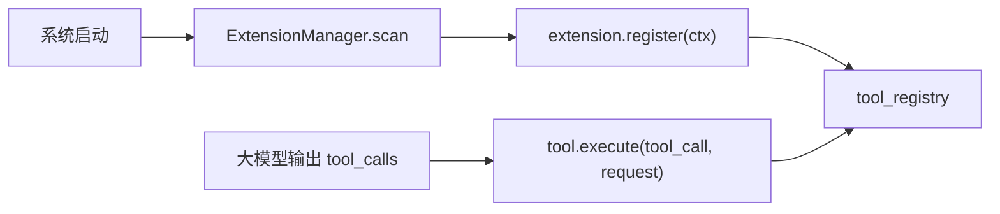

# 自定义工具开发指南

本文面向**扩展工具开发者**，说明如何为智能客服系统定制 LLM 工具（Tool）：从目录结构、核心接口、发消息 API，到部署启用与测试。仓库内另有简要说明见 [extensions.md](extensions.md)；工具在管理后台的启用方式见 [机器人大模型与工具配置说明.md](机器人大模型与工具配置说明.md)。

---

## 1. 概述

系统支持客户在 `extensions/` 目录下开发自定义工具。工具注册后与大模型内置工具（如 `send_notification`）共用同一注册表与执行框架：

- **智能回复**：大模型在对话中输出 `tool_calls`，系统调用对应工具的 `execute()` 方法。
- **HTTP 测试**：可通过 `POST /api/tool-calling/test` 单独调试工具。
- **热重载**：开发阶段可通过管理接口重载扩展，无需重启整个服务。



---

## 2. 目录与部署

### 2.1 扩展目录位置

| 环境 | 扩展根目录 | 数据文件根目录 |
|------|-----------|---------------|
| 开发运行 | `backend/extensions/<ext_name>/` | `backend/`（由 `get_extensions_base_dir()` 返回） |
| 打包 exe 运行 | `<exe 同目录>/extensions/<ext_name>/` | exe 同目录 |

系统启动时会将 `base_dir` 加入 `sys.path`，扩展以 `import extensions.<ext_name>` 方式加载。

### 2.2 标准目录结构

```
extensions/<ext_name>/
  __init__.py          # 必须，标记 Python 包
  extension.py         # register(ctx) / unregister(ctx) 入口
  tool.py              # BaseTool 子类（LLM 接口层）
  service.py           # 业务逻辑（推荐）
  message_sender.py    # 可选，多渠道发消息封装
  prompts.py           # 可选，工具内 LLM 提示词
```

### 2.3 数据文件放置

业务数据（Excel、JSON 等）建议放在 `get_extensions_base_dir()` 返回的目录下（开发时为 `backend/`，打包后为 exe 同目录）。用户传入的文件名参数应只用 `os.path.basename()` 拼接，防止路径穿越。

```python
from core.extension_manager import get_extensions_base_dir
import os

data_path = os.path.join(get_extensions_base_dir(), os.path.basename(user_filename))
```

---

## 3. 开发步骤

1. 在 `extensions/` 下创建子目录 `<ext_name>/`，添加 `__init__.py`。
2. 实现 `extension.py`，在 `register(ctx)` 中调用 `ctx.tool_registry.register_tool(...)`。
3. 实现 `BaseTool` 子类（见第 4 节），至少包含 5 个抽象方法。
4. 将扩展放到正确目录，**重启服务**或调用 `POST /api/v1/extensions/reload`（body: `{"name": "<ext_name>"}`）热重载。
5. 在管理后台对应账号的**系统配置**中开启「启用工具调用功能」，并在「选择工具」中勾选新工具（或 `selected_tools_calling` 设为 `null` 表示全部启用）。
6. 调用 `GET /api/tool-calling/tools/{tool_name}` 验证注册与参数 schema。
7. 查看启动日志，应出现类似 `[my_ext] registered my_tool_name`。

---

## 4. 核心 API 参考

### 4.1 BaseTool 抽象接口

所有工具必须继承 `BaseTool`（`schemas.base_tool.BaseTool`），并实现以下方法：

| 方法 | 签名 | 说明 |
|------|------|------|
| `get_name` | `() -> str` | 全局唯一工具名，如 `express_price_quote` |
| `get_description` | `() -> str` | 给大模型看的详细说明（参数语义、占位符、是否主动发消息等） |
| `get_tool_type` | `() -> ToolType` | 工具类型枚举（见下表） |
| `get_parameters` | `() -> Dict[str, Any]` | JSON Schema 风格参数定义 |
| `execute` | `async (tool_call: ToolCall, request: ToolExecutionRequest) -> Dict[str, Any]` | 核心执行逻辑 |

**可选重写：**

| 方法 | 默认值 | 说明 |
|------|--------|------|
| `is_enabled()` | `True` | 是否启用 |
| `get_timeout()` | `30` | 超时秒数 |
| `get_max_retry()` | `0` | 最大重试次数 |
| `get_tool_info()` | 自动聚合 | 返回完整工具元信息（一般无需重写） |

**ToolType 枚举值：**

| 枚举名 | 值 | 典型用途 |
|--------|-----|---------|
| `ToolType.ORDER` | `order` | 订单相关 |
| `ToolType.NOTIFICATION` | `notification` | 通知、发消息 |
| `ToolType.DATA_QUERY` | `data_query` | 数据查询、算价、推荐 |
| `ToolType.FILE_OPERATION` | `file_operation` | 文件读写、发媒体 |
| `ToolType.SYSTEM_ACTION` | `system_action` | 系统操作 |

**execute 返回约定：**

- 参数校验失败 / 业务错误：返回 `{"success": False, "error": "..."}`，**尽量不抛异常**。
- 业务成功：返回 `{"success": True, ...业务字段}`。
- 若工具会**主动发消息**给客户，建议在 `get_description` 中说明：编排层宜设置 `requires_tool_result: false`，避免工具已发消息后又由模型二次回复造成重复。

**参数读取：**

```python
params = tool_call.parameters or {}
query = str(params.get("query") or "").strip()
```

### 4.2 get_parameters 格式

返回 JSON Schema 风格对象，供大模型与 `GET /api/tool-calling/tools` 接口使用：

```python
def get_parameters(self) -> Dict[str, Any]:
    return {
        "type": "object",
        "properties": {
            "query": {
                "type": "string",
                "description": "查询条件",
            },
            "top_k": {
                "type": "integer",
                "description": "返回数量，默认 5",
                "minimum": 1,
                "maximum": 10,
            },
        },
        "required": ["query"],
    }
```

可在 `execute` 中额外支持中文别名（参考 `express_price_calc` 对「补差基数」「长(cm)」等的兼容），但 schema 中仍建议以英文键为主。

### 4.3 ExtensionContext（注册阶段）

扩展入口 `register(ctx)` / `unregister(ctx)` 收到的 `ctx` 类型为 `ExtensionContext`：

| 成员 | 类型 / 签名 | 用途 |
|------|------------|------|
| `tool_registry` | `ToolRegistryProxy` | 注册 / 注销工具 |
| `logger` | logger | 打日志，建议前缀 `[ext_name]` |
| `db_factory()` | `() -> Session` | 获取 SQLAlchemy 会话，**用完必须 `close()`** |

**ToolRegistryProxy 方法：**

| 方法 | 说明 |
|------|------|
| `register_tool(tool_instance)` | 注册 `BaseTool` 实例；扩展卸载时系统自动移除 |
| `unregister_tool(tool_name)` | 手动注销（一般不必，卸载扩展时自动处理） |
| `get_tool(tool_name)` | 获取已注册工具 |
| `list_tools()` | 列出工具名 |

**extension.py 模板：**

```python
from .service import MyService
from .tool import MyTool

_service = MyService()

def register(ctx):
    tool = MyTool(_service, ctx.db_factory)
    try:
        ctx.tool_registry.register_tool(tool)
        ctx.logger.info("[my_ext] registered my_tool")
    except Exception as e:
        ctx.logger.warning(f"[my_ext] failed to register: {e}")

def unregister(ctx):
    ctx.logger.info("[my_ext] unregister called")
```

`register` 内应用 `try/except` 包裹，注册失败**不得阻塞**系统启动。

### 4.4 ToolCall（单次工具调用）

| 字段 | 类型 | 说明 |
|------|------|------|
| `tool_name` | `str` | 工具名称 |
| `tool_type` | `ToolType` | 工具类型（系统会从注册表校正） |
| `parameters` | `Dict[str, Any]` | LLM 传入的参数 |
| `description` | `Optional[str]` | 调用描述 |
| `timeout` | `int` | 超时秒数，默认 30，范围 1–300 |
| `retry_count` | `int` | 重试次数，默认 0，最大 3 |
| `priority` | `int` | 优先级 1–10，默认 1 |

### 4.5 ToolExecutionRequest（运行时上下文）

工具 `execute(tool_call, request)` 的第二个参数：

| 字段 | 类型 | 说明 |
|------|------|------|
| `tool_calls` | `List[ToolCall]` | 本次批量调用列表 |
| `user_id` | `Optional[str]` | 发送者用户 ID |
| `group_id` | `Optional[str]` | 聊天配置 / 会话 ID |
| `group_name` | `Optional[str]` | 群组或私聊显示名称 |
| `config_id` | `Optional[int]` | 微信 / 企微 / 闲鱼账号配置 ID |
| `llm_config_id` | `Optional[int]` | 本轮 LLM 配置 ID |
| `context` | `Optional[Dict[str, Any]]` | 会话上下文（见 4.6） |
| `parallel_execution` | `bool` | 是否并行执行，默认 `True` |
| `max_execution_time` | `int` | 最大执行时间（秒），默认 60 |

### 4.6 request.context 常用字段

智能回复构建的上下文 dict，工具可按需读取：

```python
{
    "user_message": str,                    # 当前用户消息
    "group_info": {
        "id": str,                          # 群组/会话 ID
        "name": str,                        # 显示名
        "chat_type": str,                   # 聊天类型（若有）
        "xianyu_chat_id": str,              # 闲鱼专用
        "xianyu_to_id": str,                # 闲鱼专用
        "bot_user_id": str,
        "bot_display_name": str,
    },
    "user_info": {
        "id": str,
        "name": str,
    },
    "group_knowledge": str,                 # 群组知识库文本
    "relevant_faqs": [...],                 # 相关 FAQ
    "relevant_products": [...],             # 相关商品
    "recent_chat_history": [                # 最近聊天记录
        {
            "sender_id": str,
            "sender_name": str,
            "content": str,
            "timestamp": str,
            "message_type": str,
        }
    ],
}
```

**读取示例：**

```python
ctx = request.context or {}
group_info = ctx.get("group_info") or {}
user_msg = ctx.get("user_message") or ""
```

### 4.7 数据库访问

通过 `ctx.db_factory()` 或 `database.base.SessionLocal` 获取会话：

```python
db = self._db_factory()
try:
    # 查询、发消息等
    ...
finally:
    db.close()
```

### 4.8 工具内调用 LLM（可选）

若工具内部需要再调大模型（如排序、抽取），使用：

```python
from core.llm_manager import get_llm_service

resp = await get_llm_service().generate_response_with_messages(
    system_message="你是...",
    user_message="用户条件：...",
    config_id=request.llm_config_id,  # None 则使用默认 enabled 配置
)
# resp: {"success": bool, "content": str, "error": str}
if not resp.get("success"):
    # 应有降级逻辑，勿直接抛异常
    ...
content = resp.get("content") or ""
```

参考实现：`backend/extensions/mobile_plan_recommender/service.py`（LLM 失败时回退关键词匹配）。

### 4.9 大模型工具调用 JSON 格式（附录）

大模型输出需为 JSON（系统也支持从 markdown 代码块中解析）：

```json
{
  "reply_content": "回复给用户的文本",
  "reply_type": "text",
  "requires_tool_result": false,
  "tool_calls": [
    {
      "tool_name": "my_tool",
      "tool_type": "data_query",
      "parameters": {"query": "示例"},
      "description": "调用说明"
    }
  ],
  "confidence": 0.9
}
```

- `requires_tool_result: false`（默认）：先回复用户，工具在后台执行。
- `requires_tool_result: true`：等工具结果返回后再由模型组织二次回复。
- 工具**主动发消息**时，通常配合 `requires_tool_result: false`。

---

## 5. 在工具中发送消息

扩展工具**没有**统一注入的 `send_message` 函数，需按渠道 import 底层服务。推荐参考 `backend/extensions/express_price_calc/message_sender.py` 封装多渠道逻辑。

### 5.1 通用：解析账号与接收方

#### resolve_wechat_config

```python
from utils.wechat_config_resolver import resolve_wechat_config

config = resolve_wechat_config(db, request)  # -> Optional[WeChatConfig]
```

**解析优先级：** `request.config_id` → `request.group_id` → `request.group_name`（查 active 群组）。

**WeChatConfig.account_type 含义：**

| account_type | 渠道 |
|--------------|------|
| `""` 或 `personal` | 个人微信 |
| `official` | 企业微信（第三方） |
| `xianyu` | 闲鱼 |

#### 接收方 recipient_id 解析惯例

1. 工具参数中的 `recipient_id`（若有）
2. 否则 `request.group_id`
3. 否则 `request.group_name`

```python
recipient_id = (recipient_id_override or "").strip()
if not recipient_id:
    recipient_id = (request.group_id or request.group_name or "").strip()
```

### 5.2 个人微信 — 文本

```python
from core.wechat_manager import get_wechat_service
from schemas.wechat import MessageSend, MessageType

wechat_service = get_wechat_service()
result = wechat_service.send_message(
    MessageSend(
        chat_id=recipient_id,       # 必填：群名/好友昵称/会话 ID
        content=text,               # 必填，最长 5000 字符
        message_type=MessageType.TEXT,
        at_users=[],                # 可选：@ 用户列表
        reply_to=None,              # 可选：回复的消息 ID
    )
)
# result: MessageSendResult
#   success: bool
#   message_id: Optional[str]
#   error: Optional[str]
#   timestamp: datetime
```

**MessageType 可选值：** `text`, `image`, `voice`, `video`, `file`, `link`, `card`, `location`, `system` 等。

若 `get_wechat_service()` 未初始化或微信未连接，`send_message` 返回 `success=False`。

### 5.3 企业微信第三方

#### 获取已登录实例

```python
from models.wecom_third_party import WeComThirdPartyInstance

instance = (
    db.query(WeComThirdPartyInstance)
    .filter(
        WeComThirdPartyInstance.wecom_user_id == config.wxid,
        WeComThirdPartyInstance.status == 2,  # 2 = 已登录
    )
    .first()
)
# instance.guid, instance.license_code 用于发消息
```

#### 初始化服务

```python
from services.wecom_third_party_service import WeComThirdPartyService
from utils.config_manager import get_config_manager

server_url = get_config_manager(db).get_config("wecom_third_party.server_url", "") or ""
wecom_service = WeComThirdPartyService(server_url=server_url, db=db)
```

#### 常用发消息方法

| 方法 | 参数 | 说明 |
|------|------|------|
| `send_text_message` | `guid`, `content`, `to_id`, `license_code` | 发送文本 |
| `send_link_message` | `guid`, `title`, `icon_url`, `link_url`, `desc`, `to_id`, `license_code` | 链接卡片 |
| `send_location_message` | `guid`, `title`, `address`, `latitude`, `longitude`, `to_id`, `license_code` | 定位 |
| `send_personal_card_message` | `guid`, `shared_id`, `to_id`, `license_code` | 名片 |
| `send_hyper_text_message` | `guid`, `content`, `to_id`, `license_code` | @ 消息 / 混合文本 |
| `send_image_message_by_file_name` | `guid`, `filename_or_path`, `to_id`, `license_code` | 按文件名/路径发图片（相对路径基于 uploads） |
| `send_video_message_by_file_name` | `guid`, `filename_or_path`, `to_id`, `license_code`, `cover_image_size=0`, `duration=0` | 发视频 |
| `send_file_message_by_file_name` | `guid`, `filename_or_path`, `to_id`, `license_code` | 发文件 |

**send_hyper_text_message 的 content 格式：**

```python
content = [
    {"subtype": 0, "text": "请大家注意："},
    {"subtype": 1, "text": "7881301987664"},  # @指定 userId；text="0" 表示 @所有人
    {"subtype": 0, "text": " 请尽快处理"},
]
wecom_service.send_hyper_text_message(
    guid=instance.guid,
    content=content,
    to_id=recipient_id,
    license_code=instance.license_code,
)
```

**返回值：** 各方法返回 `Dict[str, Any]`（第三方 API 响应）；可能含 `pending` 表示异步受理。

### 5.4 闲鱼

```python
from services.xianyu_service import XianyuService

session = XianyuService._sessions.get(config.id)
if not session:
    return {"ok": False, "channel": "xianyu", "detail": "闲鱼会话未运行"}

group_info = (request.context or {}).get("group_info") or {}
chat_id = group_info.get("xianyu_chat_id") or request.group_id or recipient_id
to_id = group_info.get("xianyu_to_id") or request.user_id or recipient_id

# 文本
session.send_message(chat_id, to_id, text)

# 图片
session.send_image(chat_id, to_id, image_path_or_url, width=800, height=600)

# 可选：落库发出的文本
db_group_id = str(request.group_id or group_info.get("id") or "").strip()
if db_group_id:
    XianyuService.save_outgoing_text_message(config.id, db_group_id, text)
```

闲鱼发送依赖 `context.group_info.xianyu_chat_id` 与 `xianyu_to_id`（或 `request.user_id`）。

### 5.5 推荐封装：三渠道统一入口

参考 `express_price_calc/message_sender.py` 的 `send_quote_text_to_customer`：

```python
def send_text_to_customer(
    db: Session,
    request: ToolExecutionRequest,
    recipient_id_override: Optional[str],
    text: str,
) -> Dict[str, Any]:
    """
    返回 {"ok": bool, "channel": str, "detail": str}
    """
    recipient_id = str(recipient_id_override or "").strip()
    if not recipient_id:
        recipient_id = (request.group_id or request.group_name or "").strip()
    if not recipient_id:
        return {"ok": False, "channel": "", "detail": "缺少接收方"}

    config = resolve_wechat_config(db, request)
    if not config:
        # 回退个人微信
        ...

    account_type = (config.account_type or "").strip()
    if account_type == "xianyu":
        ...
    if account_type == "official":
        ...
    # 默认个人微信
    ...
```

### 5.6 内置发消息工具（供 LLM 编排，扩展内一般直接调底层服务）

以下工具已内置，大模型可直接调用；扩展开发者若要在 `execute` 内发消息，建议 import 第 5.2–5.4 节的底层 API，而非再注册同名工具。

| 工具名 | 类型 | 说明 |
|--------|------|------|
| `send_notification` | notification | 发送文本通知（个人微信 / 企微） |
| `send_media` | file_operation | 发送图片 / 视频 / 文件 |
| `send_location` | notification | 发送定位（企微） |
| `send_link` | notification | 发送链接卡片（企微） |
| `send_at_notification` | notification | 发送 @ 消息（企微） |
| `send_personal_card` | notification | 发送名片（企微） |
| `send_favorite` | file_operation | 从微信收藏发送（个人微信） |

各工具参数详见 [机器人大模型与工具配置说明.md](机器人大模型与工具配置说明.md)。

---

## 6. 参考扩展示例

### 6.1 express_price_calc — 带发消息的数据查询工具

路径：`backend/extensions/express_price_calc/`

| 文件 | 职责 |
|------|------|
| `extension.py` | 注册 `ExpressPriceQuoteTool`，注入 `ctx.db_factory`，启动 Excel 变更轮询 |
| `tool.py` | 参数 schema、中文别名、`send_to_customer` + `message_template` 编排 |
| `service.py` | 读 Excel 价格表、计价、模板占位符替换 |
| `message_sender.py` | 个人微信 / 企微 / 闲鱼三渠道发文本 |

**工具名：** `express_price_quote`  
**类型：** `data_query`

**设计要点：**

- 数据文件 `快递价格表.xlsx` 放在 `get_extensions_base_dir()` 下。
- `send_to_customer` 默认 `true`；仅需 JSON 时传 `false`。
- `unregister` 中调用 `_service.stop_mtime_poller()` 停止后台线程。
- 主动发消息后返回 `message_sent`、`send_status` 等字段供排查。

**execute 成功返回示例（发消息）：**

```python
{
    "success": True,
    "quotes": [...],
    "origin_province": "安徽",
    "dest_province": "广东",
    "message_sent": True,
    "formatted_message": "...",
    "send_status": "sent",  # 或 "failed" / "skipped" / "validation_failed"
}
```

### 6.2 mobile_plan_recommender — 纯查询 + LLM 排序

路径：`backend/extensions/mobile_plan_recommender/`

| 文件 | 职责 |
|------|------|
| `extension.py` | 简单注册，无 DB、无后台任务 |
| `tool.py` | 最小 `execute`：读参数 → 调 service → 返回 JSON |
| `service.py` | HTTP 抓取套餐页、日级缓存、LLM 推荐 + 关键词 fallback |
| `prompts.py` | LLM 排序用的 system / user 提示词 |

**工具名：** `mobile_plan_recommend`  
**类型：** `data_query`

**设计要点：**

- 不使用 `request` 也能工作；结果 JSON 由大模型组织自然语言回复。
- 适合「只查不算、不发消息」类工具。
- LLM 失败时不抛异常，回退 `_fallback_recommend()`。

**execute 成功返回示例：**

```python
{
    "success": True,
    "query": "联通50左右的",
    "cache_hit": False,
    "source_updated_at": "2026-06-21T10:00:00",
    "source_refreshed": True,
    "plans": [
        {
            "name": "【江西省】广电姜黄卡",
            "description": "29元包180G通用+250分钟通话",
            "apply_url": "https://...",
            "details": "仅发江西",
            "reason": "匹配条件:联通 50左右的",
        }
    ],
}
```

### 6.3 hello_ext — 最小入门模板

路径：`backend/extensions/hello_ext/`

**extension.py + tool.py 完整示例：**

```python
# extension.py
from schemas.base_tool import BaseTool
from schemas.tool_calling import ToolType, ToolCall, ToolExecutionRequest
from typing import Any, Dict

class HelloTool(BaseTool):
    def get_name(self) -> str:
        return "hello_tool"

    def get_description(self) -> str:
        return "Hello 扩展示例工具，返回问候语"

    def get_tool_type(self) -> ToolType:
        return ToolType.SYSTEM_ACTION

    def get_parameters(self) -> Dict[str, Any]:
        return {
            "type": "object",
            "properties": {
                "name": {"type": "string", "description": "要问候的名字"},
            },
        }

    async def execute(self, tool_call: ToolCall, request: ToolExecutionRequest) -> Dict[str, Any]:
        name = (tool_call.parameters or {}).get("name") or "world"
        return {"success": True, "result": f"hello, {name}!"}


def register(ctx):
    try:
        ctx.tool_registry.register_tool(HelloTool())
        ctx.logger.info("[hello_ext] registered hello_tool")
    except Exception as e:
        ctx.logger.warning(f"[hello_ext] failed to register: {e}")


def unregister(ctx):
    ctx.logger.info("[hello_ext] unregister called")
```

---

## 7. 启用、测试与运维

### 7.1 管理后台启用

在对应平台（个人微信 / 企微 / 闲鱼）的**系统配置 → 自动处理配置**中：

1. 开启 **启用工具调用功能**（配置键：`{platform}.enable_tools_calling`）。
2. 在 **选择工具** 中勾选自定义工具，或留空 / `null` 表示允许全部已注册工具（配置键：`{platform}.selected_tools_calling`）。

平台前缀：`wechat`、`wecom`、`xianyu`。

### 7.2 HTTP 接口

| 接口 | 方法 | 说明 |
|------|------|------|
| `/api/tool-calling/tools` | GET | 列出全部已注册工具及参数 schema |
| `/api/tool-calling/tools/{tool_name}` | GET | 查询单个工具 |
| `/api/tool-calling/test?tool_name=...` | POST | 测试执行（body 传 parameters） |
| `/api/v1/extensions/list` | GET | 扩展加载状态 |
| `/api/v1/extensions/reload` | POST | 重载指定扩展，body: `{"name": "my_ext"}` |
| `/api/v1/extensions/reload-all` | POST | 重载全部扩展 |

扩展管理接口需管理员权限。

### 7.3 日志与许可

- 启动成功：`[my_ext] registered my_tool_name`
- 注册失败：`[my_ext] failed to register: ...`（不阻塞启动）
- 扩展加载可能受 `require_extension_capability(ext_name)` 许可控制

---

## 8. 开发规范 Checklist

- [ ] 工具名全局唯一，与扩展目录名可不同但建议有关联
- [ ] `register` 内 `try/except`，失败只打 warning
- [ ] `execute` 为 `async`；内部同步代码可直接写
- [ ] DB：`db = factory(); try: ... finally: db.close()`
- [ ] 用户文件名只用 `os.path.basename()`
- [ ] 日志带 `[ext_name]` 前缀
- [ ] 业务错误返回 `success: False`，避免未捕获异常
- [ ] 主动发消息时在 `get_description` 说明 `requires_tool_result: false`
- [ ] 后台线程 / 轮询在 `unregister` 中停止
- [ ] 编写单元测试（可参考 `backend/tests/test_express_price_calc_tool.py`）

---

## 9. 附录：LLM 代码生成提示词

将下面整段复制到大模型对话中，在 **「你的需求」** 一节填入具体业务描述，即可在**无源码仓库**的情况下生成可部署的扩展代码。

````
你是 wxservice 智能客服系统的扩展工具开发助手。请根据用户需求，生成完整的 Python 扩展包，可直接放入 `extensions/<ext_name>/` 目录。

## 硬性约束

1. 目录结构必须包含：
   - `__init__.py`（可为空或一行注释）
   - `extension.py`（含 `register(ctx)` 和 `unregister(ctx)`）
   - `tool.py`（含 `BaseTool` 子类）
   - `service.py`（业务逻辑，除非极简工具可合并到 tool.py）
   - 若需发消息：另含 `message_sender.py`
   - 若需 LLM：可选 `prompts.py`

2. 工具类必须继承 `BaseTool` 并实现：
   - `get_name() -> str`  全局唯一
   - `get_description() -> str`  详细中文说明，供大模型理解
   - `get_tool_type() -> ToolType`
   - `get_parameters() -> Dict[str, Any]`  JSON Schema
   - `async execute(tool_call, request) -> Dict[str, Any]`

3. `register(ctx)` 中：
   ```python
   ctx.tool_registry.register_tool(tool_instance)
   ```
   必须用 try/except，失败 ctx.logger.warning，不 raise。

4. `execute` 返回约定：
   - 失败：`{"success": False, "error": "..."}`
   - 成功：`{"success": True, ...}`
   - 尽量不抛异常

5. 若工具会主动发消息，在 get_description 中写明：建议 requires_tool_result 设为 false。

## 类型定义（内联，勿依赖外部文档）

```python
# ToolType 枚举（schemas.tool_calling.ToolType）
# ORDER = "order"
# NOTIFICATION = "notification"
# DATA_QUERY = "data_query"
# FILE_OPERATION = "file_operation"
# SYSTEM_ACTION = "system_action"

# ToolCall 字段
# tool_name: str
# tool_type: ToolType
# parameters: Dict[str, Any]
# description: Optional[str]
# timeout: int = 30
# retry_count: int = 0
# priority: int = 1

# ToolExecutionRequest 字段
# tool_calls: List[ToolCall]
# user_id: Optional[str]
# group_id: Optional[str]          # 聊天配置/会话 ID
# group_name: Optional[str]
# config_id: Optional[int]         # 账号配置 ID
# llm_config_id: Optional[int]
# context: Optional[Dict[str, Any]]
# parallel_execution: bool = True
# max_execution_time: int = 60

# context 常用键
# user_message, group_info{id,name,chat_type,xianyu_chat_id,xianyu_to_id},
# user_info{id,name}, group_knowledge, relevant_faqs, recent_chat_history

# ExtensionContext（register 阶段）
# ctx.tool_registry.register_tool(instance)
# ctx.logger.info/warning/error(...)
# ctx.db_factory() -> Session  # 用完 close()
```

## 数据文件路径

```python
from core.extension_manager import get_extensions_base_dir
import os
path = os.path.join(get_extensions_base_dir(), os.path.basename(user_filename))
```

## 发消息模板（message_sender.py，按需使用）

```python
from typing import Any, Dict, Optional
from sqlalchemy.orm import Session
from schemas.tool_calling import ToolExecutionRequest
from schemas.wechat import MessageSend, MessageType
from core.wechat_manager import get_wechat_service
from models.wecom_third_party import WeComThirdPartyInstance
from services.wecom_third_party_service import WeComThirdPartyService
from utils.config_manager import get_config_manager
from utils.wechat_config_resolver import resolve_wechat_config


def send_text_to_customer(
    db: Session,
    request: ToolExecutionRequest,
    recipient_id_override: Optional[str],
    text: str,
) -> Dict[str, Any]:
    recipient_id = str(recipient_id_override or "").strip()
    if not recipient_id:
        recipient_id = (request.group_id or request.group_name or "").strip()
    if not recipient_id:
        return {"ok": False, "channel": "", "detail": "缺少接收方"}

    config = resolve_wechat_config(db, request)
    if not config:
        try:
            r = get_wechat_service().send_message(
                MessageSend(chat_id=recipient_id, content=text, message_type=MessageType.TEXT)
            )
            ok = r.success
            return {"ok": ok, "channel": "wechat_personal", "detail": r.error or "已发送"}
        except Exception as e:
            return {"ok": False, "channel": "wechat_personal", "detail": str(e)}

    account_type = (config.account_type or "").strip()
    if account_type == "xianyu":
        from services.xianyu_service import XianyuService
        session = XianyuService._sessions.get(config.id)
        if not session:
            return {"ok": False, "channel": "xianyu", "detail": "闲鱼会话未运行"}
        gi = (request.context or {}).get("group_info") or {}
        chat_id = gi.get("xianyu_chat_id") or request.group_id or recipient_id
        to_id = gi.get("xianyu_to_id") or request.user_id or recipient_id
        session.send_message(chat_id, to_id, text)
        return {"ok": True, "channel": "xianyu", "detail": "已发送"}

    if account_type == "official":
        instance = db.query(WeComThirdPartyInstance).filter(
            WeComThirdPartyInstance.wecom_user_id == config.wxid,
            WeComThirdPartyInstance.status == 2,
        ).first()
        if not instance:
            return {"ok": False, "channel": "wecom", "detail": "企微实例未登录"}
        server_url = get_config_manager(db).get_config("wecom_third_party.server_url", "") or ""
        svc = WeComThirdPartyService(server_url=server_url, db=db)
        svc.send_text_message(
            guid=instance.guid, content=text, to_id=recipient_id,
            license_code=instance.license_code,
        )
        return {"ok": True, "channel": "wecom", "detail": "已发送"}

    try:
        r = get_wechat_service().send_message(
            MessageSend(chat_id=recipient_id, content=text, message_type=MessageType.TEXT)
        )
        return {"ok": r.success, "channel": "wechat_personal", "detail": r.error or "已发送"}
    except Exception as e:
        return {"ok": False, "channel": "wechat_personal", "detail": str(e)}
```

## 工具内 LLM 调用模板（按需）

```python
from core.llm_manager import get_llm_service

resp = await get_llm_service().generate_response_with_messages(
    system_message="...",
    user_message="...",
    config_id=request.llm_config_id,
)
if resp.get("success"):
    content = resp.get("content") or ""
else:
    # fallback 逻辑
    ...
```

## DB 使用模板

```python
db = self._db_factory()
try:
    ...
finally:
    db.close()
```

## 输出要求

1. 按文件分段输出，每段以 `# 文件名: extensions/<ext_name>/xxx.py` 开头。
2. 输出完整可运行代码，不要省略 imports。
3. 不要输出与扩展无关的系统代码。
4. 不要输出解释性废话，先输出代码，最后简短列出：工具名、主要参数、是否在工具内发消息、数据文件放置位置。

---

## 你的需求

<!-- 在此描述你的工具需求，例如：
- 扩展目录名：my_price_tool
- 工具名：product_price_query
- 工具类型：data_query
- 功能：根据商品 SKU 查 SQLite/Excel 价格表并返回
- 参数：sku (必填), quantity (可选)
- 是否在工具内发消息：是，算价后用模板发给当前客户
- 数据文件：prices.xlsx，列有 SKU、单价
- 其它：需要日缓存、支持中文参数别名
-->

````

---

*文档版本与仓库内后端实现一致；若行为不一致，请以运行环境 `GET /api/tool-calling/tools` 接口与源码为准。*
